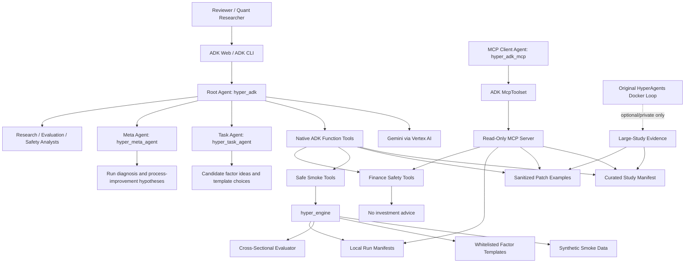
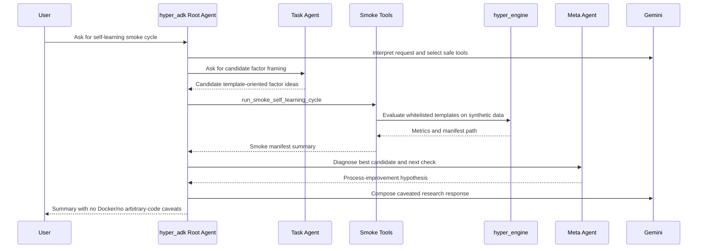
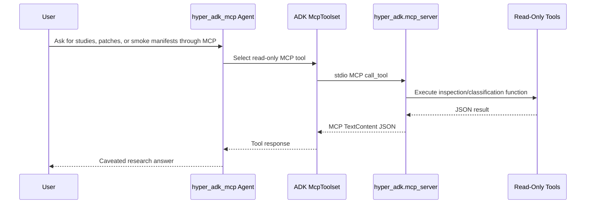

# HyperAgents-ADK Architecture

## Overview

HyperAgents-ADK is a standalone Google ADK application for safe self-learning financial factor research.

The original HyperAgents research code demonstrated a task-agent/meta-agent loop where a task agent generated candidate financial strategies and a meta agent modified the process based on evaluation results. This ADK submission preserves that architecture in a reviewer-safe form:

- The ADK task agent proposes candidate factor ideas and template-oriented research actions.
- The ADK meta agent diagnoses results and proposes process improvements.
- The public smoke engine evaluates only whitelisted project-owned factor templates on synthetic data.
- The read-only MCP server exposes evidence and artifact inspection without triggering execution.

The result is a net-new Track 1 agent application that demonstrates self-learning workflow behavior without exposing Docker, shell tools, file-editing tools, or arbitrary generated-code execution in the public demo.

## High-Level Architecture

Mermaid source is available at `assets/architecture.mmd`.



## Runtime Boundary

| Layer | Public demo status | Responsibility |
| --- | --- | --- |
| `hyper_adk` | Enabled | Root ADK coordinator, study evidence, patch examples, smoke tools, safety |
| `hyper_task_agent` | Enabled | Proposes candidate factor ideas and template-oriented actions |
| `hyper_meta_agent` | Enabled | Diagnoses outcomes and proposes process improvements |
| `hyper_engine_adk` | Enabled | ADK-native smoke-cycle agent |
| `hyper_engine` | Enabled | Synthetic data loading, whitelisted templates, evaluator, run manifests |
| `hyper_adk.mcp_server` | Enabled, read-only | MCP evidence and artifact inspection |
| Original HyperAgents Docker loop | Optional/private only | Full self-modifying research reproduction, not public demo execution |

## Native ADK Flow

Mermaid source is available at `assets/native_adk_flow.mmd`.



## MCP Flow

Mermaid source is available at `assets/mcp_flow.mmd`.



## Evidence Sources

Curated study evidence:

```text
hyper_adk/data/study_manifest.json
```

Sanitized self-learning patch examples:

```text
hyper_adk/data/learning_patch_examples.json
```

Synthetic smoke data:

```text
sample_data/sp500_smoke/
sample_data/csi300_smoke/
```

Smoke-run manifests:

```text
artifacts/runs/<run_id>/manifest.json
```

## Safety Controls

| Control | Implementation |
| --- | --- |
| No investment advice | Root prompt, safety subagent, `finance_safety_check`, evals |
| No Docker in public demo | Smoke manifest records `docker_launched: false` |
| No arbitrary generated-code execution | Whitelisted `hyper_engine.factor_templates` only |
| No shell/file-edit tools | No such tools are exposed to ADK or MCP agents |
| Synthetic data caveat | Prompts, smoke manifest, eval rubrics, docs |
| Validation vs held-out caveat | Study manifest, prompts, eval rubrics |
| Read-only MCP | `hyper_adk.mcp_server` excludes execution tools |

## Competition-Relevant Capabilities

| Criterion | Architecture support |
| --- | --- |
| Technical implementation | ADK root agent, task/meta subagents, Gemini, native tools, MCP, evals |
| Business case | Safer quant research workflow for LLM-derived financial factor discovery |
| Innovation | Self-learning task/meta architecture adapted into a bounded ADK application |
| Demo quality | Browser-based ADK Web, smoke execution, patch examples, MCP, safety refusal |
| Responsible AI | Explicit no-advice posture and no arbitrary-code public execution |
